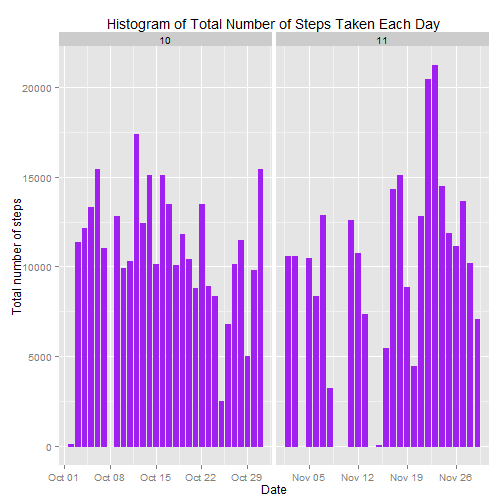

# Reproducible Research: Peer Assessment 1 

## Visible settings

```r
echo = TRUE
options(scipen = 1)
```

## Read the data

```r
activity <- read.csv("activity.csv", colClasses = c("integer", "Date", "factor"))
```

## Process/Transform the data 

```r
activity$month <- as.numeric(format(activity$date, "%m")) 
noNA <- na.omit(activity) 
rownames(noNA) <- 1:nrow(noNA) 
head(noNA) 
```

```
##   steps       date interval month
## 1     0 2012-10-02        0    10
## 2     0 2012-10-02        5    10
## 3     0 2012-10-02       10    10
## 4     0 2012-10-02       15    10
## 5     0 2012-10-02       20    10
## 6     0 2012-10-02       25    10
```

```r
dim(noNA) 
```

```
## [1] 15264     4
```

```r
noNA$month <- as.numeric(format(date, "%m")) 
library(ggplot2) 
```

### What is mean total number of steps taken per day?

For this part of the assignment, you can ignore the missing values in the dataset.

1. Make a histogram of the total number of steps taken each day

```r
ggplot(noNA, aes(date, steps)) + geom_bar(stat = "identity", colour = "purple", fill = "purple", width = 0.7) + facet_grid(. ~ month, scales = "free") + labs(title = "Histogram of Total Number of Steps Taken Each Day", x = "Date", y = "Total number of steps") 
```

 

2. Calculate and report the mean and median total number of steps taken per day

Calculate total number of steps taken per day: 

```r
totalSteps <- aggregate(noNA$steps, list(Date = noNA$date), FUN = "sum")$x 
```

Mean total number of steps taken per day: 

```r
mean(totalSteps) 
```

```
## [1] 10766
```

Median total number of steps taken per day: 

```r
median(totalSteps) 
```

```
## [1] 10765
```

