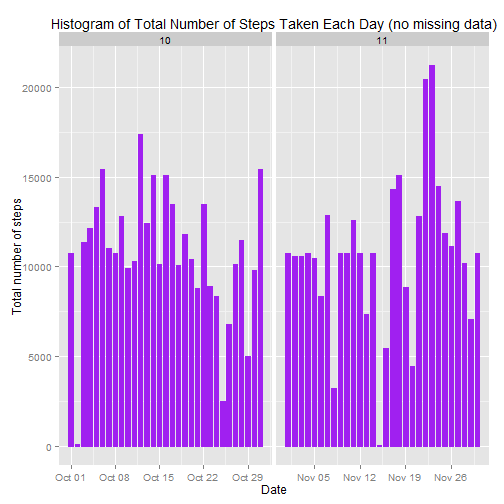

# Reproducible Research: Peer Assessment 1

## Visible settings 

```r
echo = TRUE
options(scipen = 1)
```

## Read the data

```r
activity <- read.csv("activity.csv", colClasses = c("integer", "Date", "factor"))
```

## Process/Transform the data 

```r
activity$month <- as.numeric(format(activity$date, "%m")) 
noNA <- na.omit(activity) 
rownames(noNA) <- 1:nrow(noNA) 
head(noNA) 
```

```
##   steps       date interval month
## 1     0 2012-10-02        0    10
## 2     0 2012-10-02        5    10
## 3     0 2012-10-02       10    10
## 4     0 2012-10-02       15    10
## 5     0 2012-10-02       20    10
## 6     0 2012-10-02       25    10
```

```r
dim(noNA) 
```

```
## [1] 15264     4
```

```r
noNA$month <- as.numeric(format(date, "%m")) 
library(ggplot2) 
```

### What is mean total number of steps taken per day?

For this part of the assignment, you can ignore the missing values in the dataset.

1. Make a histogram of the total number of steps taken each day

```r
ggplot(noNA, aes(date, steps)) + geom_bar(stat = "identity", colour = "purple", fill = "purple", width = 0.7) + facet_grid(. ~ month, scales = "free") + labs(title = "Histogram of Total Number of Steps Taken Each Day", x = "Date", y = "Total number of steps") 
```

 

2. Calculate and report the mean and median total number of steps taken per day

Calculate total number of steps taken per day: 

```r
totalSteps <- aggregate(noNA$steps, list(Date = noNA$date), FUN = "sum")$x 
```

Mean total number of steps taken per day: 

```r
mean(totalSteps) 
```

```
## [1] 10766
```

Median total number of steps taken per day: 

```r
median(totalSteps) 
```

```
## [1] 10765
```

### What is the average daily activity pattern?

1.Make a time series plot (i.e. type = "l") of the 5-minute interval (x-axis) and the average number of steps taken, averaged across all days (y-axis)


```r
AvgSteps <- aggregate(steps, list(interval = as.numeric(as.character(interval))), FUN = "mean")
names(AvgSteps)[2] <- "meanOfSteps"

ggplot(AvgSteps, aes(interval, y = meanOfSteps)) + geom_line() + labs(title = "Time Series Plot of the 5-minute Interval", x = "5-minute intervals", y = "Average Number of Steps Taken") 
```

 

2.Which 5-minute interval, on average across all the days in the dataset, contains the maximum number of steps?

```r
AvgSteps[AvgSteps$meanOfSteps == max(AvgSteps$meanOfSteps), ]
```

```
##     interval meanOfSteps
## 104      835       206.2
```

### Imputing missing values

Note that there are a number of days/intervals where there are missing values (coded as NA). The presence of missing days may introduce bias into some calculations or summaries of the data.

1.Calculate and report the total number of missing values in the dataset (i.e. the total number of rows with NAs)

```r
sum(is.na(activity)) 
```

```
## [1] 2304
```


2.Devise a strategy for filling in all of the missing values in the dataset. The strategy does not need to be sophisticated. For example, you could use the mean/median for that day, or the mean for that 5-minute interval, etc.

To fill in the missing values, I'll use mean steps for a five-minute interval for the entire dataset.

3.Create a new dataset that is equal to the original dataset but with the missing data filled in.

```r
activitynewData <- activity  
for (i in 1:nrow(activitynewData)) 
{ 
   if (is.na(activitynewData$steps[i])) 
     { 
      activitynewData$steps[i] <- AvgSteps[which(activitynewData$interval[i] == AvgSteps$interval), ]$meanOfSteps 
     } 
} 

head(activitynewData) 
```

```
##     steps       date interval month
## 1 1.71698 2012-10-01        0    10
## 2 0.33962 2012-10-01        5    10
## 3 0.13208 2012-10-01       10    10
## 4 0.15094 2012-10-01       15    10
## 5 0.07547 2012-10-01       20    10
## 6 2.09434 2012-10-01       25    10
```

```r
sum(is.na(activitynewData)) 
```

```
## [1] 0
```

4(a).Make a histogram of the total number of steps taken each day and Calculate and report the mean and median total number of steps taken per day.

```r
ggplot(activitynewData, aes(date, steps)) + geom_bar(stat = "identity", 
                                            colour = "purple", 
                                            fill = "purple", 
                                            width = 0.7) + facet_grid(. ~ month, scales = "free") + labs(title = "Histogram of Total Number of Steps Taken Each Day (no missing data)", x = "Date", y = "Total number of steps") 
```

 

4(b).Do these values differ from the estimates from the first part of the assignment? What is the impact of imputing missing data on the estimates of the total daily number of steps?

Mean total number of steps taken per day: 

```r
newTotalSteps <- aggregate(activitynewData$steps,  
                           list(Date = activitynewData$date),  
                           FUN = "sum")$x 
                           newMean <- mean(newTotalSteps) 
newMean 
```

```
## [1] 10766
```
Median total number of steps taken per day: 

```r
newMedian <- median(newTotalSteps) 
newMedian 
```

```
## [1] 10766
```
Compare them with the two before imputing missing data: 

```r
previousMean <- mean(totalSteps) 
previousMedian <- median(totalSteps) 
newMean - previousMean 
```

```
## [1] 0
```

```r
newMedian - previousMedian 
```

```
## [1] 1.189
```

After imputing the missing data, the new mean of total steps taken per day is the same as that of the previous mean; the new median of total steps taken per day is greater than that of the previous median.

### Are there differences in activity patterns between weekdays and weekends?

For this part the weekdays() function may be of some help here. Use the dataset with the filled-in missing values for this part.

1.Create a new factor variable in the dataset with two levels - "weekday" and "weekend" indicating whether a given date is a weekday or weekend day.


```r
head(activitynewData) 
```

```
##     steps       date interval month
## 1 1.71698 2012-10-01        0    10
## 2 0.33962 2012-10-01        5    10
## 3 0.13208 2012-10-01       10    10
## 4 0.15094 2012-10-01       15    10
## 5 0.07547 2012-10-01       20    10
## 6 2.09434 2012-10-01       25    10
```

```r
activitynewData$weekdays <- factor(format(activitynewData$date, "%A")) 
levels(activitynewData$weekdays) 
```

```
## [1] "Friday"    "Monday"    "Saturday"  "Sunday"    "Thursday"  "Tuesday"  
## [7] "Wednesday"
```

```r
levels(activitynewData$weekdays) <- list(weekday = c("Monday", "Tuesday", 
                                             "Wednesday",  
                                             "Thursday", "Friday"), 
                                 weekend = c("Saturday", "Sunday")) 
levels(activitynewData$weekdays) 
```

```
## [1] "weekday" "weekend"
```

```r
table(activitynewData$weekdays) 
```

```
## 
## weekday weekend 
##   12960    4608
```

2.Make a panel plot containing a time series plot (i.e. type = "l") of the 5-minute interval (x-axis) and the average number of steps taken, averaged across all weekday days or weekend days (y-axis). The plot should look something like the following, which was creating using simulated data:


```r
avgSteps <- aggregate(activitynewData$steps,  
                      list(interval = as.numeric(as.character(activitynewData$interval)), 
                           weekdays = activitynewData$weekdays), FUN = "mean") 
 names(avgSteps)[3] <- "meanOfSteps" 
 library(lattice) 
 xyplot(avgSteps$meanOfSteps ~ avgSteps$interval | avgSteps$weekdays,  
        layout = c(1, 2), type = "l",  
        xlab = "Interval", ylab = "Number of steps") 
```

 

